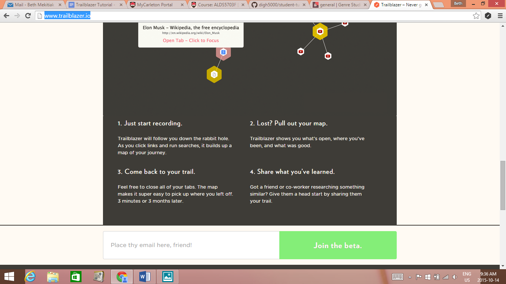
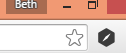

ool Tutorial: Trailblazer  

#Introduction

Trailblazer is a new Chrome extension that takes bookmarks to the next level.  The app allows users to not only track where they were online, essentially leaving breadcrumbs through the Internet, but also allows user to see a visual model of their trail.  This model shows “waystations” and “hubs”, which designate important points along a trail. Finally, the app also allows users to share their trails with others, bringing in an element of Software & 

#Setup

Trailblazer is still in its beta version, but will hopefully be fully launched in the near future. To sign up for the beta version and start trailblazing, go to: http://www.trailblazer.io/
From there, you can sign up for the beta version by entering your email address at the bottom of the page:
  
  

After this, the developers will email you with a link to follow to download the app. Once installed, you’ll see a small, black and white Trailblazer icon on the top right of  your chrome browser

When you want to start a new trail, simply click on the Trailblazer icon and click the arrow   to start recording. You can also resume a trail by clicking on the folder icon. Trailblazer will store the trails you have travelled in this folder and let you resume following them even weeks or month later.  

     

#Using the tool 

There are many uses for Trailblazer, but two stand out as most promising; research and teaching.  While traditional bookmarks list websites that a user saves, Trailblazer helps academics and students to retrace their steps while giving users a visual display of how their research is interconnected.  Let’s look at an example; one of our group member’s trail during class: https://app.trailblazer.io/public/map/4JVmj_RjBD2wGeXTuGkxKA
You can see from the above link that most of this trail is pretty linear; the user goes from one site to another without any real hubs. But, imagine what using the hyperlinks in a primary source document would look like. Imagine if you took our Known site as a hub, followed all the hyperlinks in the first few posts, and then followed those hyperlinks. What would that look like? Like this: https://app.trailblazer.io/public/map/Dw5eKYTqIN3XpTTZg141Mw
Notice here the yellow hexagons; they are the waystations. Here they represent the dhcu.ca site, and the Baking Gingerbread post. By the way, this is not even close to an exhaustive trail. 

#Conclusion 

what the reader now knows about the tool, suggestions on further directions to take the tool, readings (if available) where the tool was used to generate new insights, etc.
So what are the greater applications of a tool like Trailblazer? The most obvious applications are for online research. When I think of performing a literature review or research paper, we can certainly how Trailblazer would prevent “source amnesia” or lost information. It would also give a really clear overview of the research path as a whole which would really help to identify gaps in your research . For group projects, you could also compare trails, allowing members to see if anyone missed anything or found something no one else did.
The other implication, as was mentioned earlier, was for educational purposes.  While the app is still in it’s beta stages, there is discussion about making the app more collaborative, maybe adding a function that would allow someone like an administrator to see more than one at a time.  However, even if that never happens, it is possible to extract the data from trails in order to compare many of them at once.  In any event, this tool can be used for a variety of really interesting purposes. 

Articles for further reading/more information:

http://chronicle.com/blogs/profhacker/visualizing-your-searches-with-trailblazer/61174

http://www.wired.com/2015/02/clive-thompson-5/